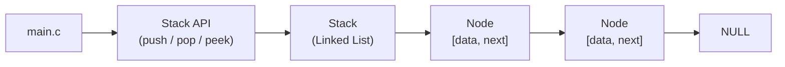

# Stack with Linked List

A simple C implementation of a stack using a linked list.

## Files

- `main.c` – demonstration program
- `Stack.c` – stack operations
- `header.h` – structure and function declarations

## Build

Use a Compiler such as `gcc`

```
gcc main.c Stack.c -o stack
```

## Block Diagram

Below is a small block diagram showing how the project components interact and how the stack is represented internally (linked list of nodes).



And a simple ASCII view of the linked list (top is leftmost):

```
top -> [data | next] -> [data | next] -> NULL
```

## Run

```
./stack
```

## Notes

- The HashMap implementation uses a hash table with an array of size 1000 (some number)
- Collisions are handled using separate chaining (linked lists)
- Each node contains a key and a pointer to the next node in the chain.
